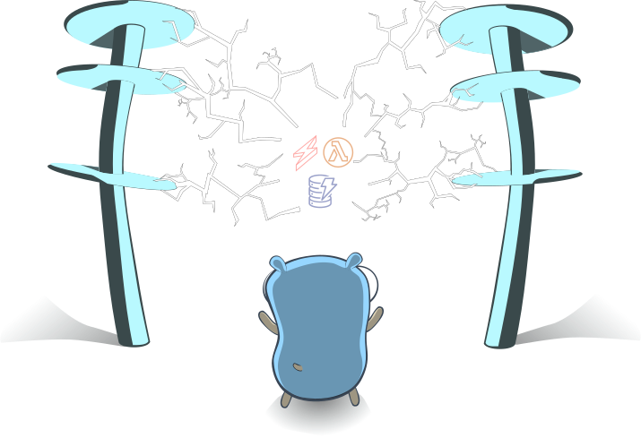

# mug - microservices understand golang
<p align="center"></p>

## Idea

mug lets you create AWS Lambda for golang projects. It boilerplates the project structure with a serverless framework configuration and a required `Makefile` to build the functions. Additionally a resource definition for Dynamo DB is generated, which creates a table for each resource to be added.
Everythink can be built and deployed using `make` and `sls deploy`.

## Features (work in progress)

- [x] create application outline
- [x] add resources with single line command
- [x] resource definition with nested objects (structs and slices)
- [x] automatically generate `serverless.yml` with resource definition for AWS Lamdba functions and AWS DynamoDB
- [ ] easy configuration and deployment
- [ ] support for custom HASH key
- [ ] support for RANGE and SORT keys
- [ ] function selection (e.g. only generate list and get method)
- [ ] create command supports generation directly in `GOPATH` (e.g. `mug create github.com/user/project`)
- [ ] resource generation from JSON
- [ ] remove resource/ functions from project

## Getting Started

- [Requirements](#requirements)
- [Installation](#installation)
- [Create a Project](#create-a-project)
- [Add a Resource](#add-a-resource)

### Requirements

mug riffs off [nerdguru's go-sls-crudl](https://github.com/nerdguru/go-sls-crudl) combining the [Dynamo DB Golang samples](https://github.com/awsdocs/aws-doc-sdk-examples/tree/master/go/example_code/dynamodb) and the [Serverless Framework Go example](https://serverless.com/blog/framework-example-golang-lambda-support/).
In order to be able to deploy the generated code please make sure to have the following in place/ installed:


* AWS Account (duh!)
* golang (double duh!)
* [serverless framework](https://serverless.com/framework/docs/getting-started/)
* [dep](https://golang.github.io/dep/) (golang dependancy management tool)
* [aws-cli](https://docs.aws.amazon.com/de_de/cli/latest/userguide/cli-chap-welcome.html) wouldn't hurt, but is not necessarily required

### Installation

To get mug just run
```
go get github.com/crolly/mug
```
This will create the cobra executable under your `$GOPATH/bin` directory.

### Create a Project

The create command generates the boilerplate for project.
```
mug create projectname [flags]
```
This will create the directory in case it doesn't already exist. The structure will generally look like this:

* Makefile - used for dep package management and compiling the functions, so only binaries will be uploaded to AWS
* serverless.yml - defines the AWS Dynamo DB tables, AWS Lambda function definitions and AWS API Gateway events
* mug.config.json - used to register the project and resource generation as base for Makefile and serverless updates
* Gopkg.toml - keeps track of the dependencies

In general everything generated can be ammended afterwards to adjust to your personal requirements before deployment. If you require some help setting up server less, [follow the instructions here](https://serverless.com/blog/anatomy-of-a-serverless-app/#setup).

### Add a Resource

The add resource command lets you define a new resource. The CRUDL functions will be generated in the `functions/resourcename/` folder and the `Makefile` and `serverless.yml` will be updated accordingly.

#### Simple Resource Definition

For example, let's create a course resource, which has a couple of simple attributes. `cd` into the project directory and run:
```
mug add resource course -a name,subtitle,description
```

This will generate the following files in the folder `functions/course/`:
```
-rw-r--r-- course.json
-rw-r--r-- create.go
-rw-r--r-- delete.go
-rw-r--r-- list.go
-rw-r--r-- read.go
-rw-r--r-- update.go
```

The resource definition is kept track of in the `course.json` like this. I use this as a development step to eventually enable definition through json input:

```
{
  "name": "course",
  "type": "Course",
  "ident": "course",
  "attributes": [
    {
      "name": "id",
      "ident": "id",
      "goType": "uuid.UUID",
      "awsType": "S",
      "hash": true
    },
    {
      "name": "name",
      "ident": "name",
      "goType": "string",
      "awsType": "S",
      "hash": false
    },
    {
      "name": "subtitle",
      "ident": "subtitle",
      "goType": "string",
      "awsType": "S",
      "hash": false
    },
    {
      "name": "description",
      "ident": "description",
      "goType": "string",
      "awsType": "S",
      "hash": false
    }
  ],
  "nested": null,
  "imports": [
    "github.com/satori/go.uuid"
  ]
}
```
The course's struct looks like this:
```
// Course defines the Course model
type Course struct {
	ID uuid.UUID `json:"id"`
	Name string `json:"name"`
	Subtitle string `json:"subtitle"`
	Description string `json:"description"`
}
```
As you can see an `ID` attribute of type `uuid.UUID` is automatically added. This `ID` will also be used as the hash key for the table. The type for an attribute is by default `string` if none is provided. E.g., if you would like to add a number just provide the golang type like this:
```
mug add resource course -a "name,subtitle,description,price:float"
```

#### Complex Resource Definition with Nested Objects

Dynamo DB being a NoSQL database you certainly cannot use relationships like you may be used to from relational databases like MySQL or PostgreSQL. Usually you overcome this by deciding which entities you work with (querying, writing, etc.) and embedding all related information directly to them. With mug you can easily generate such resources with a little more complex attribute definition to the `-a` flag. `{}` wraps nested objects (`1-1` relationship) and `[]` wraps slices of objects (`1-n` relationship).
For example, let's generate a user, who has an address and may have multiple enrollments to courses:

```
mug add resource user -a "name,isActive:bool,email,address:{street,zip,city},enrollments:[courseID:uuid.UUID,startDate:time.Time,EndDate:time.Time]"
```

**Please make sure to wrap the attribute definition with `"`(double quotes) to ensure the recursive parsing works!** 

The struct(s) will look like this:
```
// User defines the User model
type User struct {
	ID uuid.UUID `json:"id"`
	Name string `json:"name"`
	IsActive bool `json:"is_active"`
	Email string `json:"email"`

	Address Address `json:"address"`
	Enrollments []Enrollments `json:"enrollments"`
}

// Address defines the Address model
type Address struct {
	Street string `json:"street"`
	Zip string `json:"zip"`
	City string `json:"city"`
}

// Enrollments defines the Enrollments model
type Enrollments struct {
	CourseID uuid.UUID `json:"course_id"`
	StartDate time.Time `json:"start_date"`
	EndDate time.Time `json:"end_date"`
}
```

Of course, you can also reference the `ID` in an object, however, you will have to manage this in your own code - getting the `ID` or multiple `IDs` for `m-n` relationships and fetching the referenced objects afterwards.

### Deploy to AWS

To deploy your application just run `make` and `sls deploy`:
```
➜  mug-example git:(master) ✗ make       
env GOOS=linux go build -ldflags="-s -w" -o bin/course/create
env GOOS=linux go build -ldflags="-s -w" -o bin/course/read
env GOOS=linux go build -ldflags="-s -w" -o bin/course/update
env GOOS=linux go build -ldflags="-s -w" -o bin/course/delete
env GOOS=linux go build -ldflags="-s -w" -o bin/course/list
env GOOS=linux go build -ldflags="-s -w" -o bin/user/create
env GOOS=linux go build -ldflags="-s -w" -o bin/user/read
env GOOS=linux go build -ldflags="-s -w" -o bin/user/update
env GOOS=linux go build -ldflags="-s -w" -o bin/user/delete
env GOOS=linux go build -ldflags="-s -w" -o bin/user/list

➜  mug-example git:(master) ✗ sls deploy
Serverless: Packaging service...
Serverless: Excluding development dependencies...
Serverless: Creating Stack...
Serverless: Checking Stack create progress...
.....
Serverless: Stack create finished...
Serverless: Uploading CloudFormation file to S3...
Serverless: Uploading artifacts...
Serverless: Uploading service mug-example.zip file to S3 (11.52 MB)...
Serverless: Validating template...
Serverless: Updating Stack...
Serverless: Checking Stack update progress...
....................................................................................................................................................................................
Serverless: Stack update finished...
Service Information
service: mug-example
stage: dev
region: us-east-1
stack: mug-example-dev
resources: 60
api keys:
  None
endpoints:
  POST - https://x3zenhqppl.execute-api.us-east-1.amazonaws.com/dev/courses
  GET - https://x3zenhqppl.execute-api.us-east-1.amazonaws.com/dev/courses/{id}
  PUT - https://x3zenhqppl.execute-api.us-east-1.amazonaws.com/dev/courses/{id}
  DELETE - https://x3zenhqppl.execute-api.us-east-1.amazonaws.com/dev/courses/{id}
  GET - https://x3zenhqppl.execute-api.us-east-1.amazonaws.com/dev/courses
  POST - https://x3zenhqppl.execute-api.us-east-1.amazonaws.com/dev/users
  GET - https://x3zenhqppl.execute-api.us-east-1.amazonaws.com/dev/users/{id}
  PUT - https://x3zenhqppl.execute-api.us-east-1.amazonaws.com/dev/users/{id}
  DELETE - https://x3zenhqppl.execute-api.us-east-1.amazonaws.com/dev/users/{id}
  GET - https://x3zenhqppl.execute-api.us-east-1.amazonaws.com/dev/users
functions:
  create_course: mug-example-dev-create_course
  read_course: mug-example-dev-read_course
  update_course: mug-example-dev-update_course
  delete_course: mug-example-dev-delete_course
  list_courses: mug-example-dev-list_courses
  create_user: mug-example-dev-create_user
  read_user: mug-example-dev-read_user
  update_user: mug-example-dev-update_user
  delete_user: mug-example-dev-delete_user
  list_users: mug-example-dev-list_users
layers:
  None
```

**This will deploy your app to AWS and you can now develop against your new serverless API! Yeah!**
