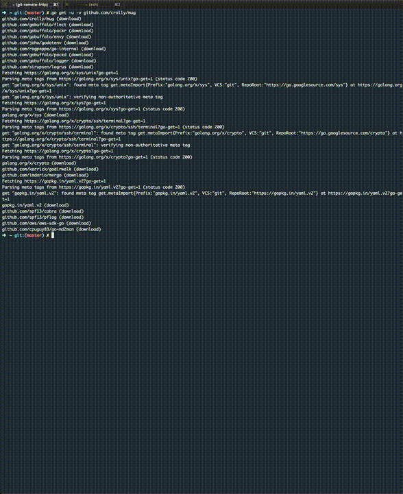

# mug - microservices understand golang

## Idea

**mug** lets you create AWS Lambda for **go** projects directly integration **DynamoDB** if you wish so.

It boilerplates the project structure with a serverless framework configuration. Additionally a resource definition for Dynamo DB is generated, which creates a table for each resource to be added.

## Documentation

The documentation can be found [here](https://crolly.github.io/mug).

## Quick Start

The following commands will spin up a quick example project and add a simple resource.

* `go get github.com/crolly/mug`
* `mug create github.com/crolly/mug-example`
* `cd $GOPATH/src/github.com/crolly/mug-example`
* `mug add resource course -a "name,description,price:float32"`

You can then start your newly created serverless API locally with `mug debug` and test it before deploying.

Just open a new console window or tab and try the following commands:
* `curl -X POST http://127.0.0.1:3000/courses -d '{"name":"Test Course","description":"Course created to test the API","price":9.99}'`
* `curl http://127.0.0.1:3000/courses`

To eventually deploy just run `mug deploy`.

**Make sure to have your serverless framework configuration setup accordingly beforehand.**

You can run the same `curl` commands however this time use the provided URL from AWS and not the localhost.

{style="display: block; margin: 0 auto"}
